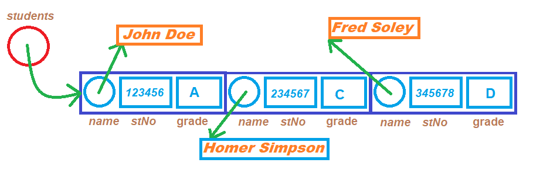

# Workshop #2: References, Function Overloading, Dynamic Memory

* Version 1.1<br />
  Part 1: Added the sort implementation and corrected the one argument load function description<br />
  Part 2: Corrected the bad records in db.csv


In this workshop, you will use references, overload functions, and deallocate (free) memory.

## The Overview session

The overview session will be held on Tue. May 24th at 16:20.

To join the session click here [WS2 Overview](https://connect.rna2.blindsidenetworks.com/invite/to?c=Gi-j-XmXYNxwWNPGwrbe2Y6Yb3tuSAldPoK2NZn3uUk&m=f182c5fed6c3b14d3a8379e50632e1a4ffbbe5a0&t=1653422432457&u=senecacollege)

## Learning Outcomes

Upon successful completion of this workshop, you will have demonstrated the abilities to:

- Overload functions
- Dynamic Memory Allocation and Management
- Use References to pass back information through arguments of a function
- Use default value for arguments of a function

## Submission Policy

This workshop is divided into two coding parts and one non-coding part:

- Part 1 (**LAB**): A step-by-step guided workshop, worth 50% of the workshop's total mark
> Please note that the part 1 section is **not to be started in your first session of the week**. You should start it on your own before the day of your OOP244 class and join the first session of the week to ask for help and correct your mistakes (if there are any).
- Part 2 (**DIY**): A Do It Yourself type of workshop that is much more open-ended and is worth 50% of the workshop's total mark.  
- *reflection*: non-coding part, to be submitted together with *DIY* part. The reflection doesn't have marks associated with it but can incur a **penalty of max 40% of the whole workshop's mark** if your professor deems it insufficient (you make your marks from the code, but you can lose some on the reflection).
- Submissions of part 2 that do not contain the *reflection* (that is the **non-coding part**) are not considered valid submissions and are ignored.

## Due Dates

Depending on the section you are enrolled in, the submission due day of the week may shift a day or two. Please choose the "-due" option of the submitter program to see the exact due date of your section:

```bash
~profname.proflastname/submit 2??/wX/pY -due<ENTER>
```
- Replace **??** with your subject code (`00 or 44`)
- Replace **X** with Workshop number: [`1 to 10`]
- Replace **Y** with the part number: [`1 or 2`]

### Overall workshop due days
- day 1: Workshop open for preview<br/>
  (If you need to check your program with the submitter, you can use `-feedback` option to test the execution without submission)
- day 2: submission opens for both part 1 and 2
- day 5: (end of day) Part 1 due
- day 8: (end of day) Part 2 due
- day 9: (end of day) submissions rejected

If at the deadline (end of day 8) the workshop is not complete, there is an extension of **one day** when you can submit the missing parts.  **The code parts that are submitted late receive 0%.**  After this extra day, the submission closes; if the workshop is incomplete when the submission closes (missing at least one of the coding or non-coding parts), **the mark for the entire workshop is 0%**.

## Citation

Every file that you submit must contain (as a comment) at the top:<br />
**your name**, **your Seneca email**, **Seneca Student ID** and the **date** when you completed the work.

### For work that is done entirely by you (ONLY YOU)

If the file contains only your work or the work provided to you by your professor, add the following message as a comment at the top of the file:

> I have done all the coding by myself and only copied the code that my professor provided to complete my workshops and assignments.

### For work that is done partially by you.

If the file contains work that is not yours (you found it online or somebody provided it to you), **write exactly which part of the assignment is given to you as help, who gave it to you, or which source you received it from.**  By doing this you will only lose the mark for the parts you got help for, and the person helping you will be clear of any wrongdoing.

> - Add the citation to the file in which you have the borrowed code
> - In the 'reflect.txt` submission of part 2 (DIY), add exactly what is added to which file and from where (or whom).

> :warning: This [Submission Policy](#submission-policy) only applies to the workshops. All other assessments in this subject have their own submission policies.

### If you have helped someone with your code

If you have helped someone with your code. Let them know of these regulations and in your 'reflect.txt' of part 2 (DIY), write exactly which part of your code was copied and who was the recipient of this code.<br />By doing this you will be clear of any wrongdoing if the recipient of the code does not honour these regulations.

## Compiling and Testing Your Program

All your code should be compiled using this command on `matrix`:

```bash
g++ -Wall -std=c++11 -g -o ws file1.cpp file2.cpp ...
```

- `-Wall`: the compiler will report all warnings
- `-std=c++11`: the code will be compiled using the C++11 standard
- `-g`: the executable file will contain debugging symbols, allowing *valgrind* to create better reports
- `-o ws`: the compiled application will be named `ws`

After compiling and testing your code, run your program as following to check for possible memory leaks (assuming your executable name is `ws`):

```bash
valgrind --show-error-list=yes --leak-check=full --show-leak-kinds=all --track-origins=yes ws
```

- `--show-error-list=yes`: show the list of detected errors
- `--leak-check=full`: check for all types of memory problems
- `--show-leak-kinds=all`: show all types of memory leaks identified (enabled by the previous flag)
- `--track-origins=yes`: tracks the origin of uninitialized values (`g++` must use `-g` flag for compilation, so the information displayed here is meaningful).

To check the output, use a program that can compare text files.  Search online for such a program for your platform, or use *diff* available on `matrix`.

> Note: All the code written in workshops and the project must be implemented in the **sdds** namespace, unless instructed otherwise.

### Custom code submission

If you have any additional custom code, (i.e. functions, classes etc) that you want to reuse in the workshop save them under a module called Utils (`Utils.cpp and Utils.h`) and submit them with your workshop using the instructions in the "[Submitting Utils Module](#submitting-utils-module)" section.

# Part 1 - LAB (50%)

***Students' Grade report*** is a program that reads an unknown number of Student records from a file and holds these records of students in a dynamically allocated array of **Student**s. (Each record holds the student's name, student number and the test grade of the students in a comma separated value format.)
After loading all the information into a dynamic array of **Student**s, the program will sort the records based on the Grade of the student in an ascending order and prints them on the screen.

## LAB Execution example

```text
1: Alice Glick, 459608: A
2: Homer Simpson, 413084: A
3: Lisa Simpson, 693664: A
4: Luann Van Houten, 737447: A
5: Maude Flanders, 272754: A
6: Allison Taylor, 747954: B
7: Apu Nahasapeemapetilon, 290816: B
8: Sarah Wiggum, 920562: B
9: Surly Duff, 146127: B
10: Bart Simpson, 753102: C
11: Abraham Simpson, 324543: D
12: Bernice Hibbert, 242653: D
13: Martin Prince, 575687: D
14: Carl Carlson, 241968: F
```

This program is partially developed; you can find all the files in the lab directory. Your responsibility is to complete the code as stated in the comments in the source code.

## The Code

The structure holding the student record is designed as follows:

```C++
   struct Student {
      char* m_name;
      int m_studentNumber;
      char m_grade;
   };
```
In addition to holding the student records in an dynamically allocated array of **Student**s, each student's name is also held in a dynamically allocated Cstring in the **Student** structure. Consider the following visual and note that every circle with an arrow in this diagram shows dynamic memory in use.

  
## Data file  
Here is a sample of the data file in the following format:<br />
```Text
student name,student number,grade<NEWLINE>
```
```Text
Abraham Simpson,324543,D
Alice Glick,459608,A
Allison Taylor,747954,B
Apu Nahasapeemapetilon,290816,B
Bart Simpson,753102,C
Bernice Hibbert,242653,D
Carl Carlson,241968,F
Homer Simpson,413084,A
Lisa Simpson,693664,A
Luann Van Houten,737447,A
Martin Prince,575687,D
Maude Flanders,272754,A
Sarah Wiggum,920562,B
Surly Duff,146127,B
```

### The Modules
There are three modules in the program:  
**File**, **Student** and **gradeReport**

#### File Module 
The following functions are already implemented in the **File** module:  
##### openFile
Opens the data file for reading  
##### closeFile  
Closes the data file
##### noOfRecords
Returns an integer that is the number of records in the file; use this function in the **Student** module to determine the size of the dynamic array of students.
#### Your coding responsibility in the File module:
Implement 3 **overloads** of a function called **read**
1. **read** function for the student name:<br />
Returns a **bool** for success and has one Cstring argument to send back the name of the student.
Use the following fscanf function to read the name of the student from the file and return true if it returns 1.  
```C
fscanf(fptr, "%[^,],"......
```
2. **read** function for the student number:<br />
Returns a **bool** for success and has one integer reference argument to pass back the student number.
Use the following fscanf function to read the student number from the file and return true if it returns 1.  
```C
fscanf(fptr, "%d,".......
```
3. **read** function for the student Grade:<br />
Returns a **bool** for success and has one character reference argument to send back the grade of the student.
Use the following fscanf function to read the Grade from the file and return true if it returns 1.  
```C
fscanf(fptr, "%c\n",......
```


#### Student Module
The Student Module has two global variables:<br />
```C
int noOfStudents;
```
**noOfStudents** should hold the number of records in the file and therefore it should be used (after setting) to allocate the dynamic array of Students.
```C
Student* students;
```
This **Student** pointer should point to the dynamic array of students. 
#### Functions

The following function is already implemented in the **Student** module:  
##### sort
This function sorts the dynamic array of students based on the Grade of the students.

#### Complete the implementation of the following functions:
##### load 
This overload of the **load** function returns a **bool** and receives a **Student** reference.<br />
In a local array of 128 characters, it will try to read the student name from the file. If successful it will find the actual length of the student name using the **strlen** function and then add one to the length (for null termination) and allocate the same amount of characters in the name of the **Student** reference. Then it will copy the read name (from the local character array) into the newly allocated name of the **Student** reference using **strcpy**.<br />
Afterwards it will read the student number and the grade into the corresponding variables of the **Student** Reference.<br />
If all the reads were successful, it will return true, otherwise false.
##### load
This overload of the **load** function that receives a file name for data file and loads all the student records into the Student array and returns a bool for success and has no arguments.<br />
First open the data file.<br />
Then set the number of students to the number of records in the file and then allocate a dynamic array of students pointed by the global **Student** pointer; **"students"** to the number of the records in the file. <br />
Then load the students one by one from the file into the dynamic array of students.<br />
If the number of records read does not match the number of records, display the following error message and return false.
```text
Error: incorrect number of records read; the data is possibly corrupted.
```
Otherwise return true.

#### Implement the following functions:
##### display
This overload of display function receives a constant student reference and prints it in the following format:  
```text
name, student number: Grade<NEWLINE>
```
##### display
This overload of the display function does not receive or return anything. <br />
First sort the array of **Student**s and then display them one by one with a row number. <br />
See the sample output.
##### deallocateMemory
This function does not return or receive anything.<br />
In a loop go through all the elements of the student array and deallocate the dynamic name of each student. Then deallocate the whole student array.

### gradeReport Module. 
Do not modify the gradeReport Module.

### Submission Process:

Upload your the files listed above to your `matrix` account. Compile and run your code using the `g++` compiler as shown in [Compiling and Testing Your Program](#compiling-and-testing-your-program) and make sure that everything works properly.

Then, run the following command from your account
- replace `profname.proflastname` with your professor’s Seneca userid
- replace **??** with your subject code (2**00** or 2**44**)
- replace **#** with the workshop number
- replace **X** with the workshop part number (**1** or **2**) 
```text
~profname.proflastname/submit 2??/w#/pX
```
and follow the instructions.

#### Submitting Utils Module
To have your custom Utils module compiled with your workshop and submitted, add a **u** to the part number of your workshop (i.e **u**p1 for part one and **u**p2 for part two) and issue the following submission command instead of the above:
```text
~profname.proflastname/submit 2??/w#/upX
```
See [Custom Code Submission](#custom-code-submission) section for more detail

> **⚠️Important:** Please note that a successful submission does not guarantee full credit for this workshop. If the professor is not satisfied with your implementation, your professor may ask you to resubmit. Re-submissions will attract a penalty.


# DIY (50%) 

A Manager's Office requires an application to go through employees' names and dates of birth and find all the employees' names and dates of birth that match a specific month.
Each line in a data file contains an employee's first name, last name, and date of birth in this format "mm/dd/yyyy" as follows
```Text
Vivian Murphy,3/20/1968
Tyler Andrews,2/2/1971
Olivia Douglas,3/28/1973
Sawyer Holmes,3/9/1975
Rebecca Farrell,3/21/1975
```

When the application starts, the manager will enter the file name to read employees' information, then he/she will enter the current month to get all employees who were born in this month to prepare the "happy birthday email".

- The number of employees in the data file could be hundreds. This amount is different in each data file.
- Although the names in the data file are not more than 30 characters, but to save memory make sure the names are kept dynamically

Your responsibility is to write a library of functions in a module called "Birthdate" that can support the main program provided to have the following execution outcome:

The names and birthdates in the file are not sorted. Your search results must be sorted based on the year of birth in ascending order.

## Mandatory functions:  
- `bool beginSearch(const char* filename)`<br/> 
  Opens the datafile. If successful it will print `Birthdate search program` and returns **true** otherwise it will print `Data file "filename goes here" not found!` and return false;
- `bool readBirthDate(int month)`</br>
  Reads the birth records matching the `month`. If at least one record is matched and read, turns **true**, otherwise **false**
- `void sort()`</br>  
  Sorts the records based on the year of birth in descending order.
- `void displayBirthdays()`</br>  
  Displays the found records as displayed in the execution sample.
- `void deallocate()`</br>
  Releases all the dynamically allocated memory.
- `void endSearch()`</br>
  Finalizes the program by making sure all resources are released and closed and then prints:
  `Birthdate Search Program Closed.`

## Tester Program
```C++
/* ------------------------------------------------------
Workshop 2 part 2
Module: N/A
Filename: main.cpp
Version 1.1
Revision History
-----------------------------------------------------------
Date       Reason
may 25th   Data file had bad records and are fixed now.
-----------------------------------------------------------*/
#include <iostream>
#include "BirthDate.h"
using namespace std;
using namespace sdds;
int main() {
   bool done = false;
   int month = 0;
   char filename[256];
   cout << "V1.1 corrected the data file records" << endl;
   cout << "Enter data file name: ";
   cin >> filename;
   if (beginSearch(filename)) {
      while (!done) {
         cout << "Enter a month of birth or 0 to exit: ";
         cin >> month;
         if (month == 0) {
            done = true;
         }
         else {
            if (readBirthDate(month)) {
               sort();
               displayBirthdays();
               deallocate();
            }
            else {
               cout << "No match found!" << endl;
            }
         }
      }
      endSearch();
   }
   return 0;
}
```

## Execution Sample
```Text
V1.1 corrected the data file records
Enter data file name: bd.csv
Birthdate search program
Enter a month of birth or 0 to exit: 11
13 birthdates found:
1) Chelsea Douglas:
1941-11-18
===================================
2) Savana Morgan:
1942-11-28
===================================
3) Joyce Moore:
1943-11-15
===================================
4) Bruce Howard:
1949-11-6
===================================
5) Nicole Andrews:
1962-11-5
===================================
6) Madaline Wells:
1968-11-1
===================================
7) Eddy Cameron:
1970-11-18
===================================
8) James Payne:
1974-11-28
===================================
9) Chelsea Murphy:
1976-11-25
===================================
10) Antony Perry:
1989-11-6
===================================
11) Ellia Craig:
1991-11-6
===================================
12) Dainton Bailey:
1997-11-7
===================================
13) Kevin Martin:
1998-11-3
===================================
Enter a month of birth or 0 to exit: 0
Birthdate Search Program Closed.
```
## 🗎 Reflection

Study your final solutions for each deliverable of the workshop, reread the related parts of the course notes, and make sure that you have understood the concepts covered by this workshop.  **This should take no less than 30 minutes of your time and the result is suggested to be at least 150 words in length.**

Create a **text** file named `reflect.txt` that contains your **detailed** description of the topics that you have learned in completing this particular workshop and mention any issues that caused you difficulty and how you solved them. To avoid deductions, refer to code in your solution as examples to support your explanations.

If your professor (or anyone else) helped you fixing parts of your code, reflect on fixes by stating who helped you, what was wrong and how it was fixed.

You may be asked to talk about your reflection (as a presentation) in class.

## Part 2 Submission (DIY)

### Files to submit:  

```reflect.txt``` and:
```Text
Birthdate.cpp
Birthdate.h
main.cpp
```

### Data Entry

Use the execution sample data for submission.

### Submission Process:

Upload your the files listed above to your `matrix` account. Compile and run your code using the `g++` compiler as shown in [Compiling and Testing Your Program](#compiling-and-testing-your-program) and make sure that everything works properly.

Then, run the following command from your account
- replace `profname.proflastname` with your professor’s Seneca userid
- replace **??** with your subject code (2**00** or 2**44**)
- replace **#** with the workshop number
- replace **X** with the workshop part number (**1** or **2**) 
```text
~profname.proflastname/submit 2??/w#/pX
```
and follow the instructions.

#### Submitting Utils Module
To have your custom Utils module compiled with your workshop and submitted, add a **u** to the part number of your workshop (i.e **u**p1 for part one and **u**p2 for part two) and issue the following submission command instead of the above:
```text
~profname.proflastname/submit 2??/w#/upX
```
See [Custom Code Submission](#custom-code-submission) section for more detail

> **⚠️Important:** Please note that a successful submission does not guarantee full credit for this workshop. If the professor is not satisfied with your implementation, your professor may ask you to resubmit. Re-submissions will attract a penalty.

